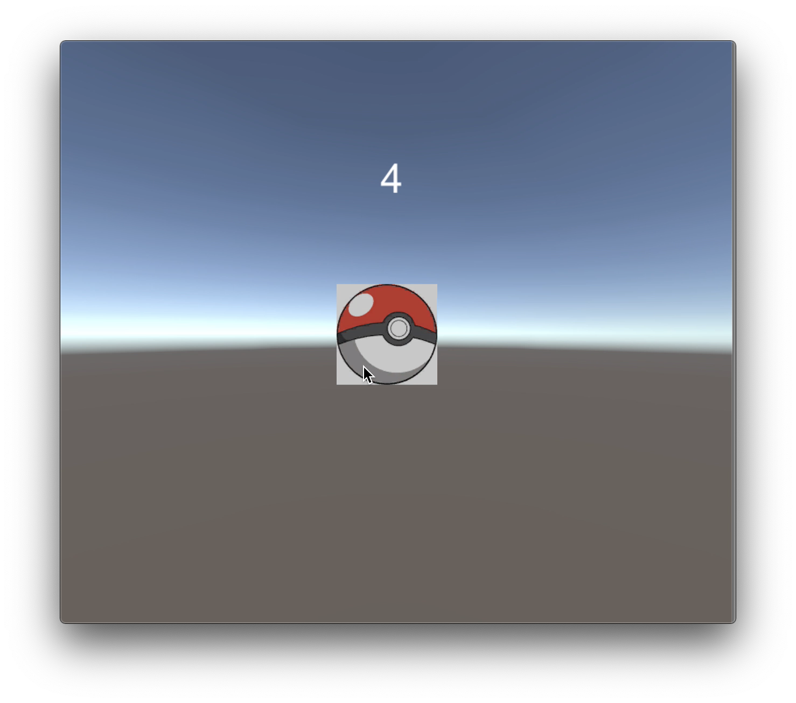
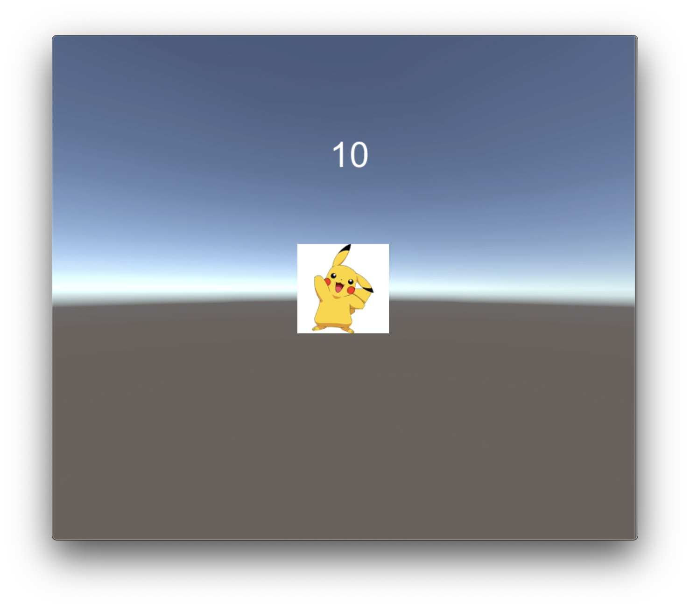

# 고 피카츄

Unity 강의를 들으며 배운 내용을 토대로 간단한 게임을 만들었습니다.

## 기능

- 랜덤으로 숫자를 생성하여 한계를 넘는 터치를 하면 포켓몬이 나옴

## 게임 플레이 방법

- 포켓볼을 터치

## 동영상

<iframe width="640" height="360" src="https://www.youtube.com/embeded/bD5kvn6xTy4" frameborder="0" gesture="media" allowfullscreen=""></iframe>

## If you click pokeball lots of time...

## Pikachu will wake!! :D

## See video
[here](https://youtu.be/bD5kvn6xTy4)
